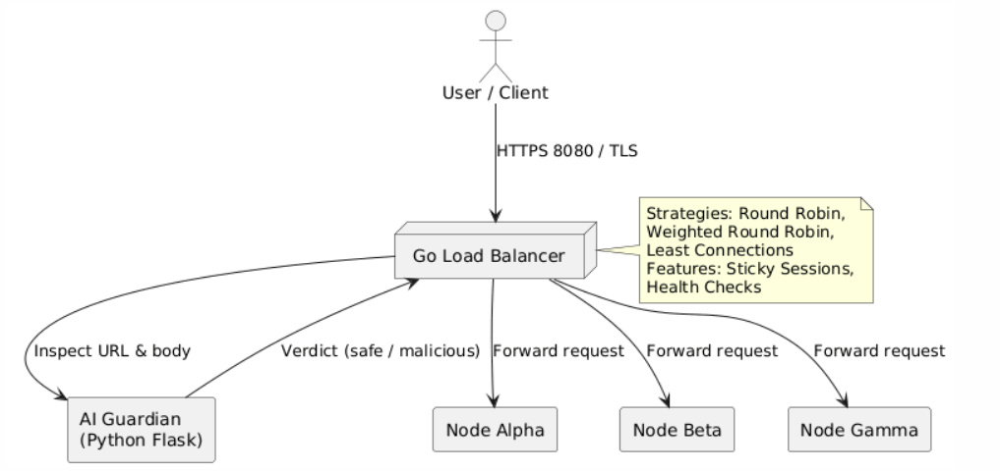

# 🛡️ Secure AI-Enhanced Load Balancer


A production-ready reverse proxy that couples a Go control plane, multiple Node.js backends, and a Python-based AI WAF. It delivers TLS termination, sticky sessions, health checks, dynamic backend management, and ML-driven inspection for SQLi and XSS payloads.

---

## 🏗️ Architecture Overview

- **Control Plane (Go):** Reverse proxy logic, load-balancing strategies, admin APIs, and health monitoring.
- **Intelligence Layer (Python):** Flask service hosting a Scikit-Learn classifier that labels requests as safe or malicious.
- **Application Layer (Node.js):** Three color-coded demo services to visualize routing decisions.



---

## 📂 Project Structure

```text
GO_FINAL_PROJECT/
├── ai_waf/
│   ├── app.py            # Flask API around the ML model
│   ├── train.py          # Training script for the logistic regression model
│   ├── requirements.txt  # Python dependencies
│   ├── Dockerfile        # Container config for AI service
│   └── waf_model.pkl     # Saved vectorizer + model bundle
├── backends/
│   └── node/
│       ├── server.js     # Demo service (blue/green/purple variants)
│       └── package.json
├── cmd/server/main.go    # Proxy entrypoint
├── pkg/
│   ├── config/           # Configuration loader
│   └── proxy/            # Load-balancer strategies, handlers, health checks
├── tests/                # Go unit tests for strategies and handlers
├── confg.json            # Runtime settings
├── docker-compose.yaml   # Python WAF + Node backends orchestration
├── cert.pem              # TLS cert (user-generated)
├── key.pem               # TLS key (user-generated)
└── README.md
```

---

## ⚙️ Configuration & Strategies

The system behavior is defined in `confg.json`. You can hot-swap strategies by changing the `strategy` field.

Supported strategies:

- `round-robin` (default): cycles through servers sequentially.
- `weighted-round-robin`: distributes traffic based on each backend's `weight`.
- `least-conn`: routes traffic to the server with the fewest active connections.

Example `confg.json`:

```json
{
  "port": 8080,
  "strategy": "weighted-round-robin",
  "health_check_frequency": "10s",
  "backends": [
    { "url": "http://localhost:8082", "alive": true, "weight": 3 },
    { "url": "http://localhost:8083", "alive": true, "weight": 1 },
    { "url": "http://localhost:8084", "alive": true, "weight": 1 }
  ]
}
```

---

## 🚀 Getting Started

### 1) Fetch the source

Option A (Git):

```bash
git clone https://github.com/mnl-lab/reverse-proxy.git
cd reverse-proxy
```

Option B (Zip): download the provided ZIP file and extract it.

### 2) Generate TLS certificates

The proxy refuses to start without valid TLS certificates.

```bash
openssl req -x509 -newkey rsa:4096 -keyout key.pem -out cert.pem -days 365 -nodes -subj "/CN=localhost"
```

Note: if `openssl` is missing on Windows, use Git Bash.

### 3) Start supporting services

Launch the AI WAF and Node.js backends using Docker:

```bash
docker-compose up --build -d
```

### 4) Run the Go proxy

```bash
# Standard run (sticky sessions enabled by default)
go run cmd/server/main.go

# Disable sticky sessions (visual load balancing)
go run cmd/server/main.go -sticky=false
```

---

## 🧪 Functional Verification

### 1) Load balancing

Visit `https://localhost:8080` (accept the self-signed cert). Refresh to watch the dashboard header colors rotate based on your strategy.

### 2) AI security (WAF)

- Safe request: `https://localhost:8080/?search=shoes` → ✅ `200 OK`
- SQL injection: `https://localhost:8080/?search=' OR 1=1 --` → ⛔ `403 Forbidden`
- Obfuscated attack: `https://localhost:8080/?search=' OR 2=2` → ⛔ `403 Forbidden` (normalization logic)

### 3) Admin API (dynamic management)

Manage backends at runtime via `http://localhost:8081`.

Get pool status:

```bash
curl http://localhost:8081/status
```

Add a new backend:

```bash
curl -X POST http://localhost:8081/backends \
  -H "Content-Type: application/json" \
  -d '{"url": "http://localhost:8085"}'
```

Remove a backend (simulate failure):

```bash
curl -X DELETE http://localhost:8081/backends \
  -H "Content-Type: application/json" \
  -d '{"url": "http://localhost:8084"}'
```

---

## 📊 Automated Tests

Execute the Go unit suite to verify load balancing and failover logic:

```bash
go test -v ./tests
```

---

## 🔧 Troubleshooting

- `docker: no such file or directory`: ensure `ai_waf/Dockerfile` has no hidden `.txt` extension.
- Browser security warning: expected with self-signed certs; click Advanced → Proceed.
- WAF misses attacks: if you modify the dataset, run `python ai_waf/train.py` locally to update the model, then rebuild with `docker-compose up --build -d`.

---

## 🎥 Demo Videos

### 1) Without sticky sessions (includes initialization)

<video src="go_demo.mp4" controls></video>

If the video doesn't render in your Markdown viewer, download it here: [go_demo.mp4](go_demo.mp4)

### 2) With sticky sessions

<video src="go_demo_sticky.mp4" controls></video>

If the video doesn't render in your Markdown viewer, download it here: [go_demo_sticky.mp4](go_demo_sticky.mp4)
